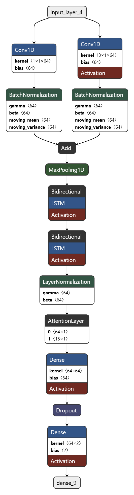

# CNN-Bi-LSTM模型用于检测阵发性房颤（PAF）  
# CNN-BiLSTM model for detecting paroxysmal atrial fibrillation (PAF)
我是生物医学工程专业的学生，这是我的大学毕设，自主搭建了一个CNN-Bi-LSTM模型（双通道的不同CNN并列独立学习后再输入给LSTM），主要功能为检测阵发性房颤，其检测性能优于传统的Bi-LSTM模型。预计准确率为90%+，召回率90%+，F1分数76%+-。  
> *仅做参考！前期学习准备的时间太多，导致模型做的比较仓促，模型性能其实还有**很大提升空间**，很多地方都没来得及继续调试，设备是21年3050ti的游戏本，实在是太慢了且内存不是很足，不能继续优化了，后续换新设备的话，有机会会更新。
### 环境配置：
- 在Spyder里用conda搭建的TensorFlow虚拟环境，用python编写的。  
### 数据集：
- 中国电生理信号挑战赛(CPSC2021)数据集，已上传数据集，如需参赛标准代码可参考git其他仓库的数据库。
- **注意：数据集一定要下载records才能使用。**  
### 模型结构:

  

- 我一开始是想直接CNN两层输入LSTM的，后面发现其实提升不大甚至会出现模型不学习的情况，后面碰巧看到并行相关，想到用不同的CNN层去独立学习，才有了目前的结构。
### 使用方法：
- 下载代码+数据集+records文件，修改代码第338行路径即可，目前仅使用了Trainingset1。
